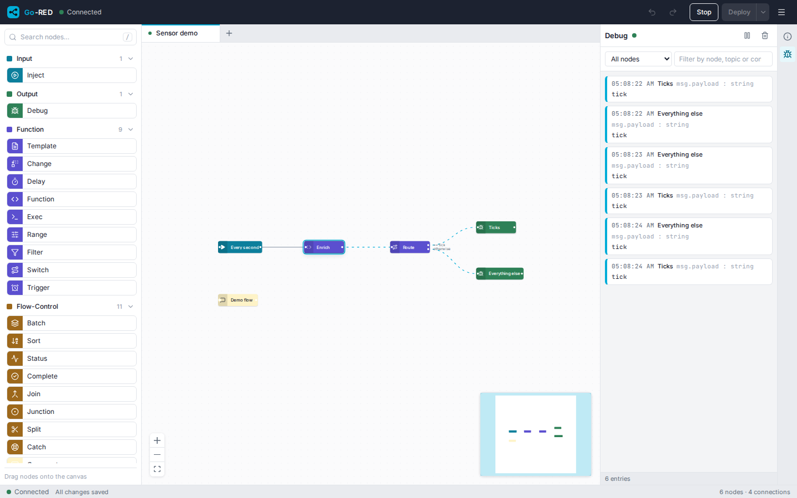
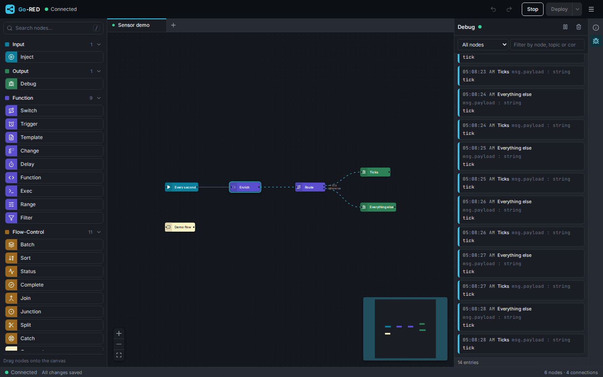

# Go-RED

A Node-RED-style flow editor and runtime in a single Go binary: wire nodes
together in the browser, deploy, and watch messages flow. The editor is
built into the binary, flows are JSON files on disk, and Node-RED
`flows.json` exports import directly.

<table>
  <tr>
    <td></td>
    <td></td>
  </tr>
</table>

## 60-second quickstart

**Release binary** (Linux, macOS, Windows; amd64 and arm64):

```bash
# pick the archive for your platform on https://github.com/GrimbiXcode/Go-RED/releases
tar -xzf go-red_*_linux_amd64.tar.gz
./go-red
```

**Docker:**

```bash
docker run -p 8080:8080 -v go-red-data:/app/data ghcr.io/grimbixcode/go-red:latest
```

**From source** (Go 1.25+, Node 22):

```bash
git clone https://github.com/GrimbiXcode/Go-RED.git && cd Go-RED
make build-all      # builds the editor, then the binary that embeds it
bin/go-red
```

Open http://localhost:8080, drag an *Inject*, a *Function* and a *Debug*
node onto the canvas, wire them, press **Deploy**: messages show up in the
Debug tab within a second. Flows are saved as you edit; deploy is what
starts them.

## What is in the box

- **Editor**: undo/redo, copy/paste across flows, rubber-band selection,
  snap to grid, align/distribute, auto-layout, context menus, quick-add by
  double-click, drop a node onto a wire to insert it, keyboard shortcuts
  (`?` lists them), tabs with drag ordering, light and dark theme,
  English and German.
- **Nodes** (47, all compiled in): inject, debug, function (JavaScript),
  switch, change, template, delay, trigger, range, filter (rbe), exec;
  split/join/batch/sort, link in/out, junction, catch/status/complete,
  comment; http in/request/response, tcp, udp, mqtt, websocket, http proxy,
  tls config; json/xml/yaml/csv/html parsers; file, file in, watch.
- **Node-RED import and export**: `flows.json` in (one flow per tab, wires
  and properties mapped, unsupported types reported), `flows.json` out.
- **Runtime feedback**: node status on the canvas, per-node counters, a
  live debug sidebar with history for late joiners.
- **Operations**: one binary, JSON flow files with backups and quarantine,
  optional access token, origin policy, rate limits, `GET /api/health`,
  `GET /api/version`, Prometheus `GET /metrics`, configuration by flags,
  `GORED_*` environment or a YAML file.
- **Measured performance**: see [`docs/PERFORMANCE.md`](docs/PERFORMANCE.md)
  (on 4 vCPUs a function-node chain moves about 90 000 messages per second).

## Compared with Node-RED

| | Go-RED | Node-RED |
|---|---|---|
| Runtime | one static Go binary, no Node.js at run time | Node.js |
| Editor | React, embedded in the binary | bundled |
| Built-in nodes | 47 core-equivalent nodes (see above) | core palette |
| Function node | JavaScript (goja): `msg`, `flow`/`global` context, no npm modules | JavaScript (V8) with npm modules |
| Extra nodes | Go packages compiled in (`docs/NODE_DEVELOPMENT.md`) | npm packages installed at run time |
| Import/export | Go-RED JSON and Node-RED `flows.json` | `flows.json` |
| Subflows, groups | not yet (skipped on import with a warning) | yes |
| Dashboard | no | via community nodes |
| Context | `flow` and `global` in memory | memory, plus persistent stores |
| Concurrency | per-flow queue and bounded goroutines, every node cancellable | single event loop |
| Auth | bearer token, origin policy, rate limits | admin auth with users and roles |
| Metrics | Prometheus `/metrics` built in | via plugin |
| Persistence | one JSON file per flow, versioned, with backups | `flows.json` |

## Configuration

Every setting has a flag, a `GORED_*` environment variable and a key in an
optional YAML file (`-config go-red.yaml` or `GORED_CONFIG`); flags win over
the environment, which wins over the file.

| Flag | Env | Default | Meaning |
|---|---|---|---|
| `-port` | `GORED_PORT` | `8080` | HTTP port |
| `-data-dir` | `GORED_DATA_DIR` | `data` | flows, backups, quarantine |
| `-auth-token` | `GORED_AUTH_TOKEN` | – | bearer token for the API, the WebSocket and `/metrics` (≥ 16 chars of `A-Z a-z 0-9 . _ ~ -`); the editor asks for it once |
| `-allowed-origins` | `GORED_ALLOWED_ORIGINS` | – | extra browser origins (`scheme://host[:port]`, comma-separated, or `*`); the editor's own origin is always allowed |
| `-rate-limit` | `GORED_RATE_LIMIT` | `60` | import/deploy requests per client and minute (`0` disables) |
| `-max-inflight` | `GORED_MAX_INFLIGHT` | `1024` | concurrent node executions per flow (a flow's `maxConcurrency` overrides it) |
| `-max-messages` | `GORED_MAX_MESSAGES` | `1000` | message queue size per flow |
| `-message-log` | `GORED_MESSAGE_LOG` | `0` | routed messages kept for `GET /api/messages` |
| `-backup-keep` / `-backup-interval` | `GORED_BACKUP_KEEP` / `GORED_BACKUP_INTERVAL` | `5` / `10m` | backups per flow file and the minimum time between two |
| `-web-dir` | `GORED_WEB_DIR` | embedded | serve the editor from a directory instead of the embedded build (development) |
| `-log-level` | `GORED_LOG_LEVEL` | `info` | `debug`, `info`, `warn`, `error` |

```yaml
# go-red.yaml
port: 8080
authToken: change-me-to-something-long
allowedOrigins: [https://dashboard.example]
rateLimit: 30
```

The server refuses cross-site browser requests unless their origin is
allowed. `GET /api/health` and `GET /api/version` are always public.
Everything on the wire is documented in [`docs/PROTOCOL.md`](docs/PROTOCOL.md).

## Documentation

| Document | What it covers |
|---|---|
| [`docs/PROTOCOL.md`](docs/PROTOCOL.md) | REST and WebSocket contract, node schemas, auth, configuration, persistence format, Node-RED mapping |
| [`docs/ARCHITECTURE.md`](docs/ARCHITECTURE.md) | components, dispatch, flow lifecycle, event flow, the editor's stores |
| [`docs/NODE_DEVELOPMENT.md`](docs/NODE_DEVELOPMENT.md) | writing a node in Go: interfaces, config schema, shared helpers, cancellation |
| [`docs/PERFORMANCE.md`](docs/PERFORMANCE.md) | benchmark results and how to read them |
| [`docs/NEXT_LEVEL_PLAN.md`](docs/NEXT_LEVEL_PLAN.md) | the audit and the seven phases that produced the current state |

## Development

```bash
make check                      # everything CI runs: gofmt, vet, race tests, generated types, web checks
go run ./cmd/go-red             # API on :8080 ...
cd web && npm run dev           # ... editor on :5173 with a proxy to it
cd web && npm run e2e:full      # Playwright against the real server
go test ./internal/engine -run '^$' -bench . -benchtime 20000x
make generate-types             # after changing Go DTOs or WebSocket message types
```

The repository layout, the rules every change follows and the per-directory
guides are in [`AGENTS.md`](AGENTS.md). Releases are cut by tagging
`vX.Y.Z` (GoReleaser builds the binaries and the multi-arch image, see
`.goreleaser.yaml`).

## Contributing

Conventional commits, tests with every change, `make check` green before a
pull request. Bug reports and node contributions are welcome.

## License

MIT, see [LICENSE](LICENSE).
