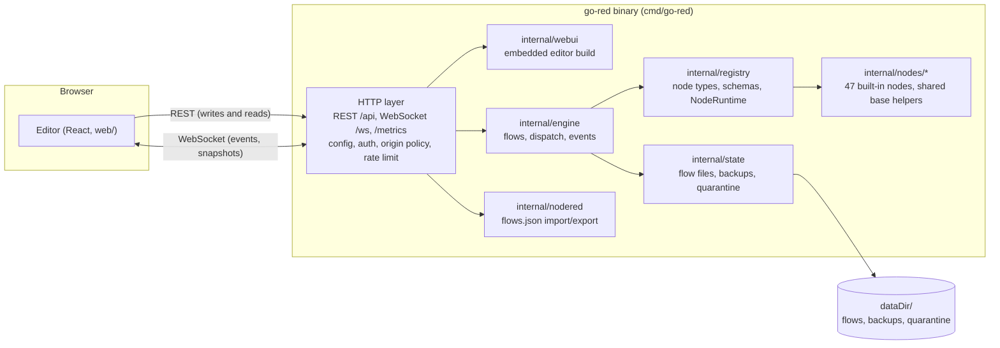
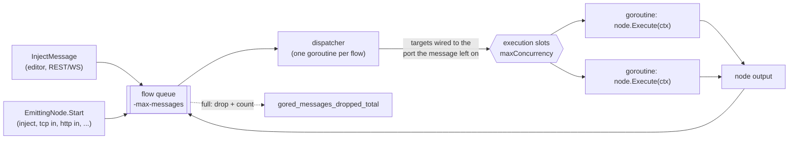
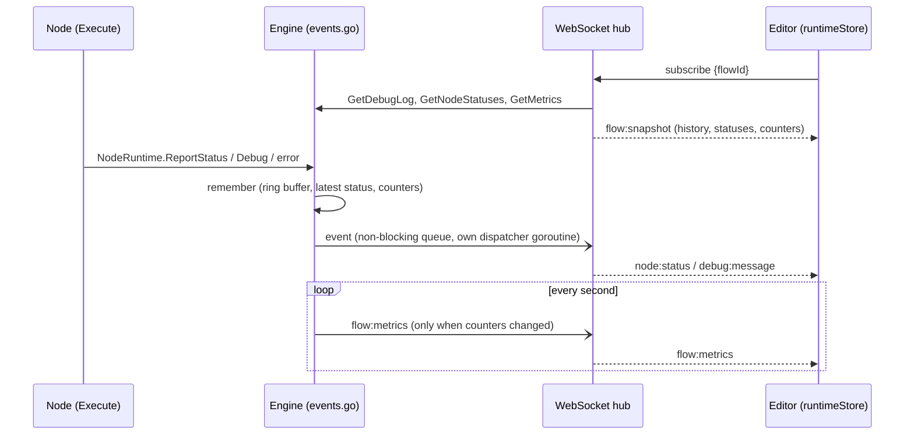
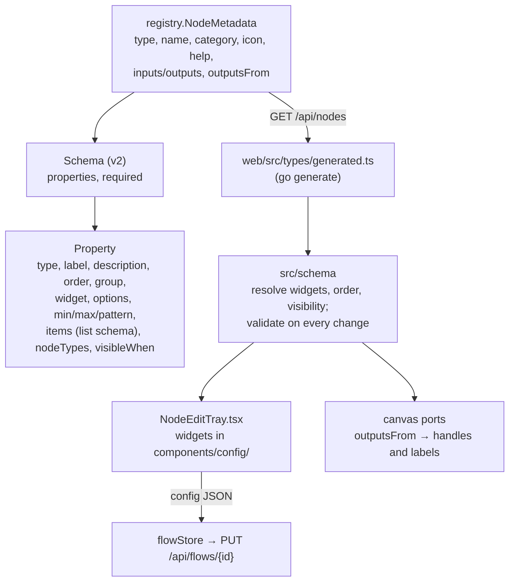

# Go—RED Architecture

## Overview

This document describes the technical architecture of Go—RED.

---

## System Architecture

One binary serves the editor and runs the flows. The diagrams in this
document are Mermaid and render on GitHub.

### Component Diagram

The REST API is the only write path; the WebSocket carries events and
read-only queries (`docs/PROTOCOL.md`).

### Core Components

1. **Flow Engine** (`internal/engine`) - flow lifecycle, message routing, runtime events
2. **Node Registry** (`internal/registry`) - node types, their schemas and the `NodeRuntime` nodes talk to
3. **Nodes** (`internal/nodes/*`, shared helpers in `internal/nodes/base`) - the built-in node implementations
4. **State Manager** (`internal/state`) - persists flows (versioned files, backups, quarantine)
5. **HTTP layer** (`cmd/go-red`) - REST, WebSocket hub, configuration, security, metrics

---

## Data Flow

Every deployed flow has its own message queue and one dispatcher goroutine:

1. A message enters the queue: injected by the editor (`InjectMessage`),
   emitted by a source node (`EmittingNode.Start`, e.g. inject, tcp in) or
   produced by a node execution.
2. The dispatcher takes it off the queue, finds the nodes wired to the port
   it left through, and runs each target in a goroutine of its own. The
   number of executions running at once is bounded per flow (a semaphore
   sized by the flow's `maxConcurrency`, default `-max-inflight`); when
   every slot is busy the dispatcher waits, the queue fills, and further
   producers drop their messages (counted in `gored_messages_dropped_total`)
   rather than block.
3. Each execution gets a context with the node timeout, derived from the
   flow's context, so undeploy cancels it; a message never inherits the
   context of the node that produced it.
4. A node's output is queued again, until nothing is wired to it.

There is no engine-wide worker pool and no lock per message on the hot
path: the message log behind `GET /api/messages` is a fixed ring that is
off unless `-message-log` is set. Undeploy (and redeploy, which is
stop-then-start) cancels the flow context, waits for the dispatcher, the
source nodes and the executions in flight, then closes node resources. All
network and timing nodes honor cancellation (dial with context, deadlines
from the context, `ctx.Done()` in every wait), so a stop never leaves a
goroutine, timer or connection behind; `go test -race` and goroutine-leak
tests keep it that way.

### Flow lifecycle

A flow definition (what the editor edits and the state manager persists)
and a running instance (a snapshot taken at deploy time) are separate
objects; editing never touches what runs until the next deploy.

```mermaid
stateDiagram-v2
    [*] --> draft: POST /api/flows, import, load from disk
    draft --> draft: PUT /api/flows/{id} (autosave of the definition)
    draft --> running: deploy - snapshot, init nodes, start dispatcher and emitters
    running --> running: PUT (definition changes, instance untouched;<br/>updatedAt > deployedAt lights Deploy)
    running --> running: deploy again = stop old instance, start new one
    running --> draft: undeploy - cancel context, wait for emitters and executions, Close nodes
    draft --> error: deploy fails (node init) - reason in the debug feed
    error --> running: deploy after the fix
    running --> [*]: DELETE (stops first)
    draft --> [*]: DELETE
```

Flows that were running are deployed again at startup (`LoadAllFlows`).

---

## Design Decisions

### Why Go?

- Goroutines for lightweight concurrency
- Channels for safe communication
- Interfaces for flexible plugin system
- Compilation for fast execution
- Standard library support for HTTP/WebSocket

### Why React?

- Component-based architecture
- Rich ecosystem (React Flow for flow editor)
- TypeScript for type safety
- Large developer community

---

## Performance Considerations

The numbers in `docs/PERFORMANCE.md` come from `go test -bench` in
`internal/engine` (inject → function → debug, switch fan-out, split → join)
against real nodes; run them before repeating any throughput claim. Per
hop the engine costs one queue send, one goroutine and one message clone;
the JavaScript function node dominates every flow that uses it.

## Configuration, security and persistence

`cmd/go-red` reads its configuration from defaults, an optional YAML file,
`GORED_*` environment variables and flags, in that order of precedence
(`config.go`). The HTTP layer (`auth.go`) applies an origin policy to every
request (same origin always, `-allowed-origins` for others, with CORS
headers), an optional bearer token on the API, the WebSocket handshake and
`/metrics`, and a per-client rate limit on import and deploy. `ops.go`
serves `/api/version` and a hand-written Prometheus exposition of the
engine's counters. `docs/PROTOCOL.md` lists every knob.

`internal/state` writes one file per flow atomically (temp file, fsync,
rename), stamps a `schemaVersion` and migrates older files through a chain
of small functions on load; the previous version of a file is kept in
`backups/` (rate limited and pruned) and files that cannot be parsed are
moved to `quarantine/` at startup.

---

## Frontend Architecture (Web UI)

The editor in `web/` is a React 18 + TypeScript app built with Vite. Its
state lives in Zustand stores under `web/src/store/`; there is no React
context for application state.

| Store | Holds | Notes |
|---|---|---|
| `flowStore` | flow list, node types, the open flow's **working copy**, undo/redo history, autosave state | the only place that edits a flow |
| `editorStore` | selection, open config tray, sidebar tab, dialogs | UI-only, never persisted |
| `runtimeStore` | node status, per-node counters and the debug feed the server pushes for the subscribed flow | server-owned, read-only for the UI; filled by `flow:snapshot` and runtime events (`store/bindServerEvents.ts`) |
| `notificationStore` | toasts | raised from stores and components alike |

### One write path

Every edit (add/move/remove node, connect, configure, rename) mutates the
working copy in `flowStore` and is recorded in the undo history. A debounced
`PUT /api/flows/{id}` (600 ms after the last edit, flushed before deploy,
on flow switch and on page unload) saves the working copy as the flow's
**draft definition**. The running instance is only replaced on
`POST /api/flows/{id}/deploy`, which the engine serves from a snapshot of
the definition. Consequently:

- nothing is ever lost to a reload: the draft is what the server holds;
- the Deploy button lights up when the draft differs from what is running
  (`updatedAt > deployedAt`, or a local edit since the last deploy);
- the WebSocket carries no mutations. It is an event and query channel:
  `flow:status`, `flow:list` and `flow:delete` go to every client after REST
  mutations and runtime changes; the client `subscribe`s to the open flow,
  receives a `flow:snapshot` (node status, counters, debug history) and from
  then on `node:status`, `debug:message` and `flow:metrics` for that flow;
  `message:send` is the inject action, `flow:get`/`state:sync` are read-only
  queries. Exactly one connection per browser tab (`lib/wsClient.ts`); after
  a reconnect the client subscribes again and the snapshot catches it up.
  Every message is listed in `docs/PROTOCOL.md`.

### Runtime feedback

The engine publishes typed events (`internal/engine/events.go`): flow
status, node status, debug entries and per-node counters. Publishing is
non-blocking (bounded queue, one dispatcher goroutine, drops are counted),
so a slow client can never slow a flow down. The engine also keeps what a
late client needs to catch up: the last 200 debug entries per flow, the
latest status per node and the counters since deploy; the WebSocket handler
turns that into the `flow:snapshot` answer to `subscribe` and forwards live
events only to subscribed clients. Nodes report status through
`NodeRuntime.ReportStatus` (Node-RED style `fill/shape/text`) and the Debug
node writes to the sidebar through `NodeRuntime.Debug` instead of stderr;
node execution errors become error entries in the same feed. In the UI the
canvas shows the status under the node, the Info tab shows status and
counters of the selected node, and the Debug tab is the live feed with
filter and clear.

### Canvas

`@xyflow/react` (v12) renders the working copy. Node positions are written
back to the store once per drag; store updates that arrive mid-drag keep the
dragged node's on-screen position, the current selection and xyflow's
measured node sizes (a node without a measurement is hidden until xyflow
re-measures it, so the merge never drops it).

### Editing ergonomics

Everything that edits several nodes at once is a store action in
`store/editorActions.ts` or `flowStore`, never canvas-local state, so undo,
autosave and the keyboard, the context menus and the tab menu all share one
implementation:

- **Clipboard** (`lib/clipboard.ts`): copy/paste/duplicate keep a JSON
  clip of nodes and the connections between them in memory and in
  `localStorage`, so it works across flows and browser tabs; pasting mints
  new ids, remaps the connections, offsets the nodes and selects them.
- **Layout** (`lib/layout.ts`): snap-to-grid (20 px), align and distribute
  the selection, and an auto-layout of the whole flow with dagre (left to
  right, ordered by the wires). Arrow keys nudge the selection by 1 px,
  with Shift by one grid step.
- **Context menus** (`components/ContextMenu.tsx`) on nodes, selections,
  wires and the empty canvas; a double-click on the canvas opens
  **Quick-Add** (`components/QuickAdd.tsx`, search and Enter); dropping a
  palette entry or an unconnected node onto a wire splices it in
  (`insertNodeOnEdge`, `spliceNodeIntoEdge`).
- **Shortcuts** (`hooks/useEditorShortcuts.ts`): `Ctrl+Z/Y`, `Ctrl+S`
  deploy, `Ctrl+C/V/D`, `Ctrl+A`, `Ctrl+F` palette search, `Ctrl+E`
  export, `Space+drag` pans, `+`/`-` zoom, `?` opens the reference
  (`components/ShortcutHelp.tsx`). Shortcuts are ignored while typing.
- **Flow tabs** (`components/FlowTabs.tsx`): double-click renames inline,
  dragging reorders (persisted as `Flow.order`, see `docs/PROTOCOL.md`),
  the context menu duplicates or deletes, and a dot marks flows that
  changed since their last deploy.

### Import and export

The export dialog offers Go-RED's own JSON or a Node-RED `flows.json`; the
import dialog accepts both and shows a preview (format, number of tabs,
node types without a Go-RED counterpart) before it posts the file. The
conversion is server-side in `internal/nodered` (one flow per tab, wires to
connections, config nodes copied into the flows that use them, per-type
property mapping, warnings for what could not be mapped); the protocol
document lists the mapping.

### Editing nodes

The edit tray (`components/NodeEditTray.tsx`) is generated from the node
type's `configSchema` (schema v2, see `docs/PROTOCOL.md`): `src/schema`
resolves labels, widgets, order, groups and visibility, and validates the
config (required, min/max, pattern, select values, typed inputs, list
items) on every change; *Done* is enabled only while the form is valid.
Widgets live in `components/config/` (text, number, select, typed input,
CodeMirror 6 code and JSON editors with `msg.` completions, rule lists with
drag ordering, key/value maps, durations with unit conversion, node
references). Output ports can depend on the config (`outputsFrom`): the
canvas draws and labels them, and saving a node drops the connections on
ports that no longer exist in the same undo step. Node `description`
(Markdown) and the type's `help` are shown in the Info sidebar; disabled
nodes are kept in the flow but skipped by the engine.

### Look and theme

All colors are design tokens (`web/src/styles/tailwind.css`): CSS custom
properties with a light and a dark value each, mapped to Tailwind utilities
(`bg-panel`, `text-muted`, `border-line`, `bg-accent`, `bg-cat-input`, ...).
Components never use raw grays, so the theme switch (`lib/theme.ts`: system
preference by default, user choice in the main menu, persisted) needs no
per-component work; `index.html` applies the stored theme before the first
paint. `src/test/tokens.test.ts` parses the stylesheet and fails when a
text/background pair drops below 4.5:1 or a category fill would not carry
white text. Node types name a Lucide icon (`NodeMetadata.icon: "timer"`);
`components/icons.ts` holds the curated set and the per-category fallback.
Nodes are 36 px cards with an icon well, round ports in the node color,
accent outline on selection and stripes when disabled (`.gr-node*` rules);
wires pulse briefly when `flow:metrics` reports traffic on their source.
`/styleguide` renders tokens, categories, node states, widgets and debug
entries in both themes from the real components.

### Routing and language

`/flow/:id` is the URL of an open flow; a reload restores it (the server
falls back to `index.html` for client routes). UI strings come from
`web/src/i18n/` (English default, German), selectable in the main menu.
